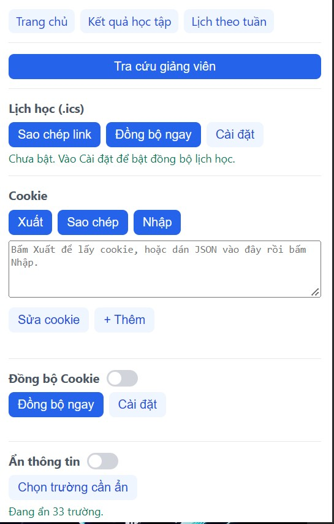
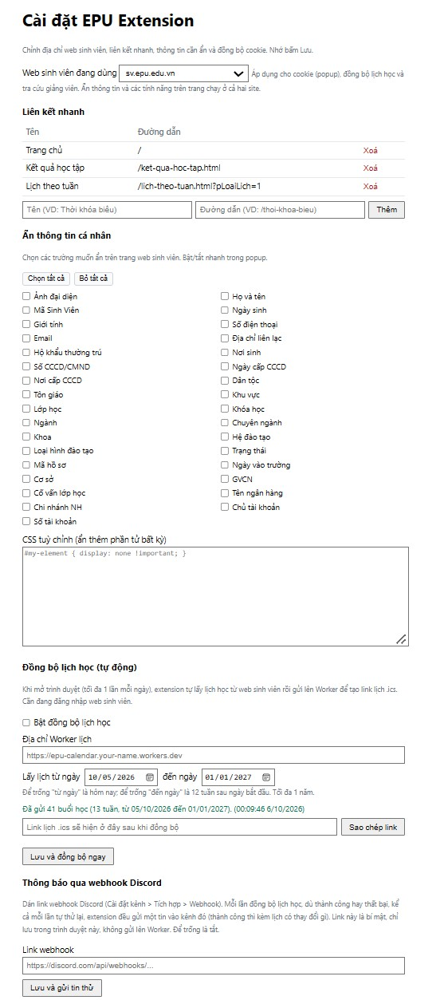
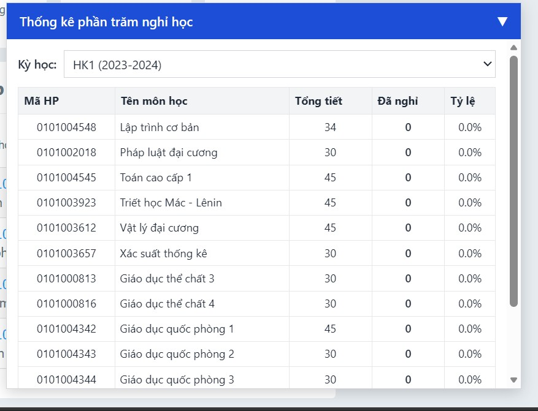
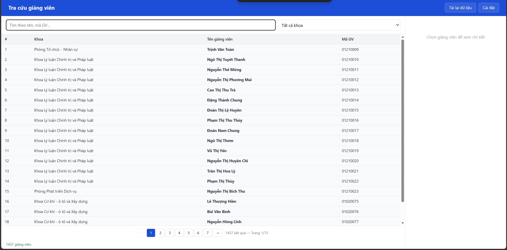
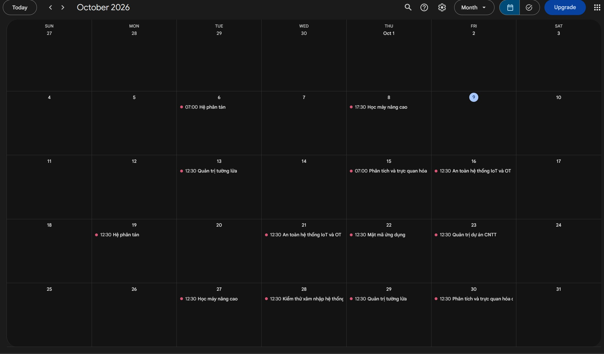
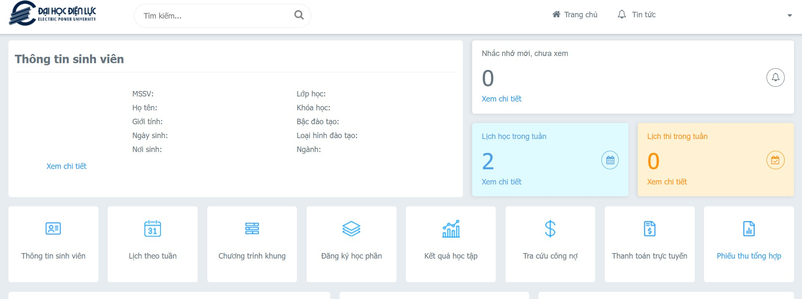

# EPU Extension

Tiện ích trình duyệt (Chrome / Edge / Cốc Cốc / Firefox, Manifest V3) giúp sinh viên Đại học Điện lực (EPU) thao tác nhanh hơn trên web sinh viên `https://sv.epu.edu.vn` và `https://thanhtoanhocphi.epu.edu.vn`: liên kết nhanh, thống kê nghỉ học, tra cứu giảng viên, đồng bộ lịch học ra `.ics`, quản lý cookie, ẩn thông tin cá nhân và quét mã QR.

> Extension chưa lên Chrome Web Store, cài thủ công theo hướng dẫn bên dưới. Cài xong, mở popup sẽ thấy **số phiên bản** và được **tự báo khi có bản mới** trên GitHub.

## Ảnh minh họa

> Các ảnh nằm trong thư mục [`screenshots/`](screenshots/). Nếu đang thấy ảnh vỡ nghĩa là chưa có file — xem [screenshots/README.md](screenshots/README.md) để biết cần chụp gì.

| Popup | Trang cài đặt |
|---|---|
|  |  |

## Tính năng

### Liên kết nhanh
Popup có sẵn các nút mở nhanh những trang hay dùng (Trang chủ, Thời khóa biểu, Xem điểm, Đăng ký tín chỉ…). Danh sách liên kết sửa được trong trang Cài đặt — thêm/xóa tùy ý, đường dẫn tương đối sẽ tự ghép với địa chỉ web sinh viên đang chọn.

### Thống kê % nghỉ học
Ngay trên trang điểm danh của web sinh viên, extension chèn thêm cột **phần trăm đã nghỉ** cho từng môn (tính theo số tiết nghỉ trên tổng số tiết), giúp bạn thấy nhanh môn nào sắp chạm ngưỡng cấm thi. Bấm vào số buổi nghỉ để xem bảng chi tiết từng buổi.



### Tự kiểm tra điểm danh & báo thay đổi
Extension tự đọc trang điểm danh (tối đa 30 phút một lần) và **lưu lại theo từng MSSV**. Khi số buổi nghỉ (có phép / không phép) của môn nào đó thay đổi, nó hiện thông báo nổi ngay trên trang để bạn biết liền, không phải tự vào dò.


### Tra cứu giảng viên
Trang riêng mở từ popup, cho tra cứu nhanh thông tin giảng viên. Danh sách được tải sẵn nền khi bạn vào web sinh viên nên tra cứu tức thì. Trang có nút Cài đặt ở góc trên.



### Đồng bộ lịch học ra `.ics` (tự động)
Bật trong Cài đặt. Khi mở trình duyệt (tối đa **1 lần thành công mỗi ngày**), extension tự lấy lịch học theo tuần từ web sinh viên bằng chính cookie đăng nhập có sẵn, rồi tạo ra một link lịch `.ics`. Thêm link đó vào **Google Calendar / Outlook / lịch điện thoại** để lịch học tự cập nhật trên mọi thiết bị.



Chi tiết hoạt động:
- **Khoảng ngày**: chọn "từ ngày … đến ngày …" trong Cài đặt (tối đa 1 năm). Để trống thì lấy từ hôm nay đến 12 tuần sau.
- **Cập nhật từng tuần**: lịch cập nhật theo từng tuần chạm vào khoảng đã chọn; tuần nào được đồng bộ lại thì làm mới hoàn toàn (buổi bị hủy/đổi trong tuần đó biến mất), các tuần khác giữ nguyên.
- **Tự thử lại**: lỗi tạm thời (mất mạng, server báo 5xx) sẽ tự thử lại sau 1, 5, 15, 30 rồi mỗi 60 phút (tối đa 12 lần/ngày, dùng `chrome.alarms`). Lỗi cần bạn xử lý (chưa đăng nhập, chưa biết MSSV…) thì không thử lại mà đợi lần mở trình duyệt / vào web sinh viên tiếp theo.
- **MSSV tự lấy** từ web sinh viên, không cần nhập. Dữ liệu lịch lưu riêng theo từng MSSV nên đổi tài khoản không bị lẫn.
- Nút **Đồng bộ ngay** ở popup / Cài đặt để chạy tay bất cứ lúc nào.

### Thông báo qua webhook Discord (tùy chọn)
Dán link webhook Discord trong Cài đặt là **mỗi lần đồng bộ lịch** đều được gửi một tin về kênh Discord: thành công (kèm thay đổi gì — thêm/hủy buổi, đổi phòng/giảng viên/giờ, hoặc "không có thay đổi"), thất bại kèm lý do, và cả mỗi lần tự thử lại. Link webhook là bí mật nên chỉ lưu trong trình duyệt (`chrome.storage.local`), **không gửi đi đâu khác**.

### Quản lý cookie
Trong popup có thể **xuất / sao chép / nhập / sửa / xóa** cookie của web sinh viên — tiện khi cần sao lưu phiên đăng nhập hoặc chuyển sang thiết bị/trình duyệt khác.

### Ẩn thông tin cá nhân
Chọn trong Cài đặt những trường muốn ẩn khỏi trang web sinh viên (họ tên, MSSV, CCCD, số tài khoản…) — tiện khi quay màn hình, chụp ảnh hỏi bài hay chia sẻ màn hình. Bật/tắt nhanh ngay trong popup. Có ô CSS tùy chỉnh để ẩn thêm phần tử bất kỳ.



### Quét mã QR bằng phím tắt
Nhấn **Alt+Q**: extension chụp màn hình, cho bạn kéo chọn vùng chứa mã QR, rồi giải mã và xử lý theo loại:
- **Liên kết** → tự mở tab mới.
- **Wi-Fi, VietQR, email, số điện thoại, vị trí, văn bản** → hiện kết quả kèm nút sao chép / mở.

Đổi phím tắt tại `chrome://extensions/shortcuts`.


## Cài đặt

Extension cài thủ công ở **chế độ nhà phát triển** (chưa có trên store).

### Chrome / Edge / Cốc Cốc
1. Tải mã nguồn: trên GitHub bấm **Code → Download ZIP** rồi giải nén (hoặc `git clone`). Nhớ thư mục chứa file `manifest.json`.
2. Mở trang tiện ích: `chrome://extensions` (Edge: `edge://extensions`; Cốc Cốc: `coccoc://extensions`).
3. Bật **Chế độ nhà phát triển** (Developer mode) ở góc trên bên phải.
4. Bấm **Tải tiện ích đã giải nén** (Load unpacked) và trỏ tới thư mục vừa giải nén.
5. Extension xuất hiện; trang Cài đặt tự mở lần đầu — kiểm tra địa chỉ web sinh viên. Ghim icon lên thanh công cụ cho tiện dùng.

### Firefox
Mở `about:debugging` → **This Firefox** → **Load Temporary Add-on** → chọn file `manifest.json`. (Bản nạp tạm sẽ mất khi đóng Firefox.)

### Cập nhật
Mở popup sẽ thấy phiên bản hiện tại; nếu có bản mới trên GitHub, popup hiện thanh báo kèm nút dẫn tới trang tải. Tải bản mới rồi làm lại bước Load unpacked (hoặc bấm nút nạp lại ở trang tiện ích).

## Quyền và quyền riêng tư
- **Quyền cố định**: `storage`, `activeTab`, `scripting`, `cookies`, `notifications`, `alarms` (dùng cho việc thử lại đồng bộ lịch) và truy cập `*://sv.epu.edu.vn/*`, `*://thanhtoanhocphi.epu.edu.vn/*`. Phải giữ cả `http`: cookie đăng nhập `ASC.AUTH` không có cờ Secure nên Chrome xếp nó thuộc `http://sv.epu.edu.vn`; nếu chỉ cho `https`, `chrome.cookies` sẽ không thấy cookie và các tính năng cookie báo như chưa đăng nhập.
- **Quyền tùy chọn**: các địa chỉ khác (máy chủ đồng bộ lịch, hoặc web sinh viên ở domain khác) chỉ được xin khi bạn bật tính năng hoặc lưu địa chỉ đó trong Cài đặt. Chỉ chấp nhận `https://`.
- Content script chỉ chạy trên `https://sv.epu.edu.vn` và `https://thanhtoanhocphi.epu.edu.vn`. Hai site cùng phần mềm nhưng đăng nhập riêng; tính năng nào cần đăng nhập thì dùng phiên của chính site đang mở.
- **An toàn dữ liệu**: dữ liệu lấy từ server luôn được đưa vào trang bằng `textContent` / DOM API (không dùng `innerHTML`); HTML của server (bảng chi tiết nghỉ) được lọc bỏ `script` và thuộc tính `on*`. Link webhook Discord và dữ liệu cá nhân (lịch, điểm danh, cookie) chỉ lưu trong `chrome.storage.local` của trình duyệt bạn.

## Cấu trúc mã nguồn
- `manifest.json` — khai báo extension.
- `config.js` — cấu hình mặc định và hàm dùng chung cho các trang (popup, cài đặt, tra cứu giảng viên, service worker).
- `shared/` — mã dùng chung cho content script và trang giảng viên (`dom.js` dựng DOM an toàn, `teachers.js` logic giảng viên).
- `content/` — chạy trên trang web sinh viên, mỗi file một tính năng:
  - `student-info.js` (đọc MSSV/họ tên), `attendance.js` (kiểm tra điểm danh), `absent-dashboard.js` (thống kê % nghỉ), `teachers.js` (tải sẵn danh sách giảng viên), `hide-fields.js` (ẩn thông tin).
  - `main.js` — khởi động các tác vụ nền (nạp sau cùng, thứ tự khai báo trong `manifest.json`).
  - `qr-scan.js` — lớp phủ chọn vùng + giải mã + hiển thị kết quả QR (chèn khi bấm Alt+Q).
- `lib/jsQR.js` — thư viện giải mã QR (jsQR 1.4.0, Apache-2.0, kèm license).
- `background/service-worker.js` — mở tab từ QR, xử lý phím tắt, chạy đồng bộ lịch khi mở trình duyệt (`onStartup`).
- `background/webhook.js` — so sánh lịch cũ/mới và gửi thông báo Discord.
- `background/calendar-sync.js` — lấy lịch từng tuần, lưu `chrome.storage.local`.
- `popup/`, `options/` (trang cài đặt), `teachers/` (trang tra cứu giảng viên).
- `icons/` — icon 16/32/48/128.
- `tools/` — công cụ cho người phát triển, **không** đóng gói vào extension (`package.ps1`, `logo-source.png` logo gốc 818px để tạo lại icon).

## Đóng gói để phát hành
```powershell
powershell -ExecutionPolicy Bypass -File tools/package.ps1
```
Tạo `dist/epu-extension-<version>.zip` chỉ gồm các file extension cần thiết. Nhớ tăng `version` trong `manifest.json` trước khi phát hành bản mới.
